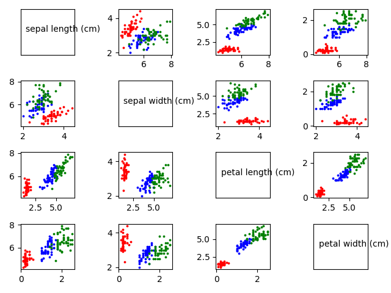
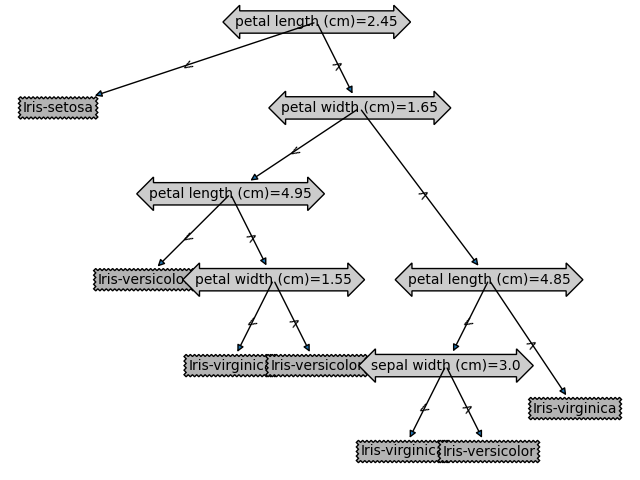
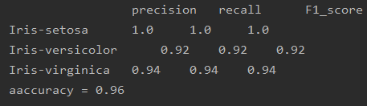
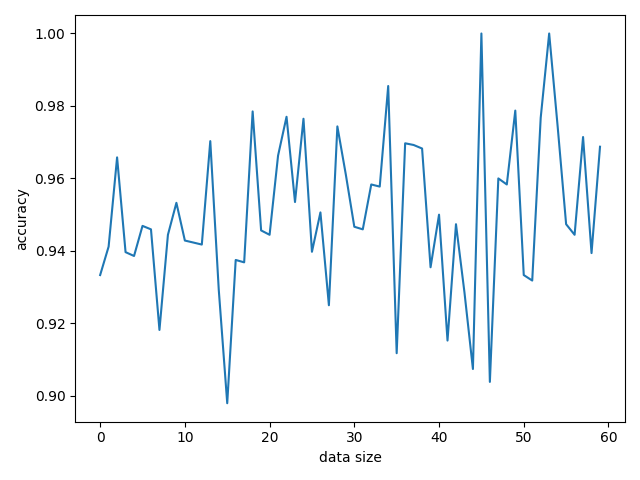
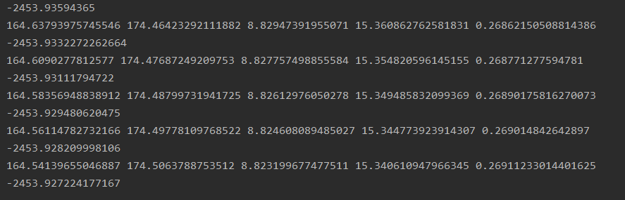
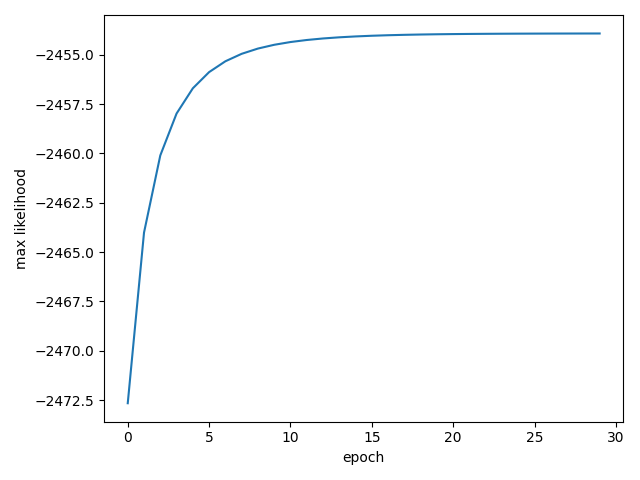

## 决策树实现Iris数据集分类

#### 一.integration_Tree.py文件功能主要为封装代码调用  
  
直接运行后可以实现数据集可视化，如下图：  
  
图中所绘制的为两两特征组合的数据分布图。  
数据文件为iris.data文件  
同时会根据sklearn库中封装的决策树函数生成决策树，如下图：  
  
并实现各种信息在输出栏中，训练准确率大于95%。
***
### 二.basicTree_train.py和basicTree_test.py为底层决策树实现绘制与测试  
首先运行basicTree_train.py训练决策树，训练结束后会绘制图像，并将决策树的测试数据、决策树的数据结构和分类标签以.txt文件形式保存：  
temp_label.txt保存标签  
test_data.txt保存测试数据  
tree.txt保存树的数据结构   
决策树可视化通过调取treePlotter.py文件进行绘制，显示效果如下：
  
  
运行basicTree_test.py文件进行决策树测试，测试结果如下：  
  
***
#### 三.bayes.py为朴素贝叶斯学习训练iris
直接运行该文件，可以得到贝叶斯训练结果  
并实现数据集多次使用，并生成准确率随数据集扩增倍数变化图像：  
 

***
#### 四.EM.py为EM算法解决混合高斯分布的参数估计
直接运行该文件，即可实现数据采样生成和参数估计过程。  
参数估计过程显示于输出栏并绘制最大似然曲线，如：  
  

***
#### 五.参考文献
决策树绘制参考：https://www.cnblogs.com/further-further-further/p/9429257.html  
底层决策树参考：https://zhuanlan.zhihu.com/p/136437598

